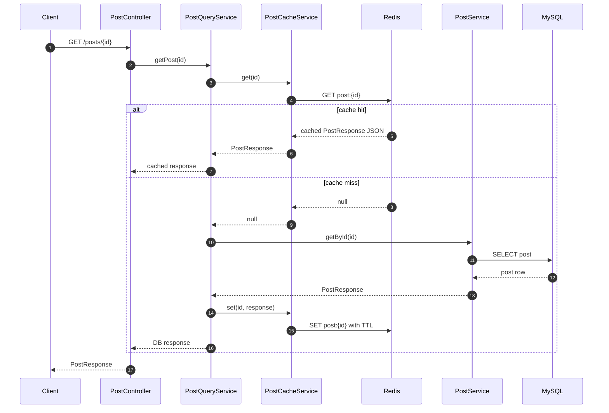
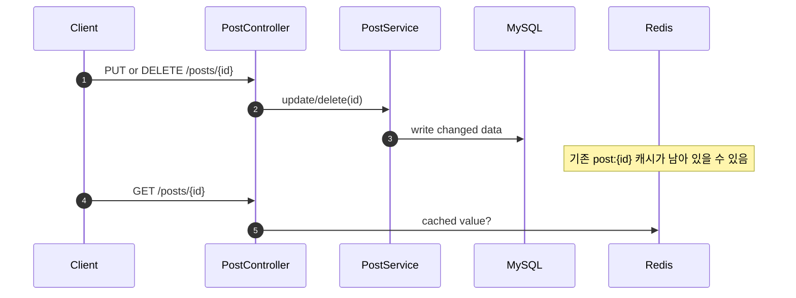
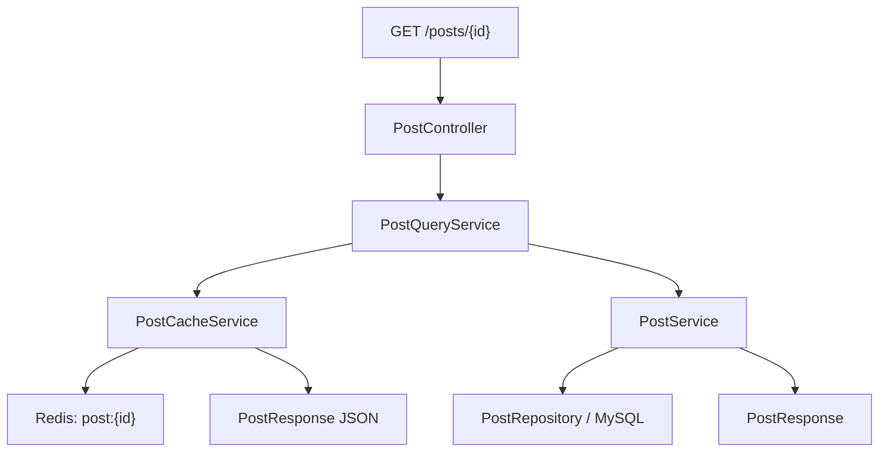

# 이론 정리

> 이번 시퀀스는 게시글 단건 조회 앞에 Redis cache-aside 흐름을 붙이는 단계입니다.
> 핵심은 DB를 대체하는 것이 아니라 반복 조회 부담을 줄이면서 hit, miss, TTL, stale data 위험을 함께 이해하는 것입니다.

## 1. Problem - 왜 캐시가 필요한가

지금까지의 게시글 단건 조회는 요청이 들어올 때마다 DB를 조회합니다. 데이터가 적을 때는 문제가 작아 보이지만, 같은 게시글을 여러 사용자가 반복해서 읽으면 DB가 같은 조회를 계속 처리해야 합니다.

캐시는 이런 반복 조회 부담을 줄이기 위한 보조 저장소입니다. 하지만 캐시를 붙이면 새로운 고민도 생깁니다.

- 캐시에 값이 있으면 DB를 거치지 않아도 됩니다.
- 캐시에 값이 없으면 DB 조회가 필요합니다.
- DB 값이 바뀌었는데 캐시에 예전 값이 남을 수 있습니다.
- key 규칙이 흔들리면 같은 데이터를 다시 쓰지 못합니다.
- TTL만으로 최신성을 모두 보장할 수는 없습니다.

이번 시퀀스는 Redis 기능 전체를 넓게 다루지 않습니다. 게시글 단건 조회 하나에 cache-aside 흐름을 붙이고, 캐시가 언제 도움 되고 언제 위험해지는지 확인합니다.

## 2. Analyze - 캐시를 붙일 때 어떤 기준을 볼 것인가

| 기준 | 질문 | 이번 코드에서 보는 곳 |
|---|---|---|
| 캐시 대상 | 어떤 조회를 캐시에 둘 것인가 | `PostController.getById(...)` |
| key 규칙 | 같은 게시글이 항상 같은 key를 쓰는가 | `PostCacheService.key(...)` |
| hit/miss 분기 | 캐시에 있으면 바로 응답하고 없으면 DB로 가는가 | `PostQueryService.getPost(...)` |
| 저장 형식 | 응답 DTO를 Redis에 어떤 형태로 저장하는가 | `PostCacheService.get(...)`, `set(...)` |
| TTL | 캐시가 영구 저장소처럼 남지 않는가 | `cache.post-ttl-seconds` |
| stale data | 수정/삭제 직후 예전 값이 남을 수 있는가 | 성공한 쓰기 뒤 evict |

Redis는 빠른 저장소이지만 기준 데이터 저장소는 DB입니다. 그래서 이번 선택은 “DB 대신 Redis”가 아니라 “DB 앞에 Redis 조회 레이어를 둔다”입니다.

## 3. API / 실행 시퀀스 다이어그램

### 3.1 게시글 단건 조회 cache-aside 흐름

miss는 오류가 아닙니다. 첫 조회나 TTL 만료 후에는 miss가 자연스럽게 발생하고, 그 다음 DB 조회와 캐시 저장으로 이어집니다.

### 3.2 수정/삭제 이후 stale data 검토 흐름

현재 구현 범위는 조회 캐시의 hit/miss/TTL과 수정/삭제 성공 후 evict입니다. 캐시를 먼저 지우지 않고 DB 변경 성공 뒤 제거하는 순서를 함께 확인합니다.

## 4. 계층 / DTO / 메시지 흐름

### 4.1 조회 계층 흐름

| 계층 | 책임 | 직접 확인할 파일 |
|---|---|---|
| Controller | 단건 조회 요청을 캐시 조회용 service로 보냅니다. | `PostController.kt` |
| Query Service | hit/miss 분기와 DB fallback을 조합합니다. | `PostQueryService.kt` |
| Cache Service | Redis key, JSON 변환, TTL 저장을 담당합니다. | `PostCacheService.kt` |
| Domain Service | DB 기준 게시글 조회를 담당합니다. | `PostService.kt` |
| Config | Redis 통신 도구를 Spring Bean으로 등록합니다. | `RedisConfig.kt` |

### 4.2 DTO와 메시지 흐름

| 단계 | 데이터 형태 | 설명 |
|---|---|---|
| HTTP 요청 | `id` path variable | 어떤 게시글을 조회할지 정합니다. |
| DB 응답 | `PostEntity` | 기준 데이터 저장소에서 읽은 도메인 데이터입니다. |
| API 응답 | `PostResponse` | 클라이언트에게 돌려줄 DTO입니다. |
| Redis 저장값 | JSON 문자열 | `PostResponse`를 문자열로 바꿔 저장합니다. |
| Redis key | `post:{id}` | 게시글 단건 캐시를 다시 찾기 위한 이름입니다. |

## 5. Action - 이번 구현에서 연결할 지점

### 5.1 Redis 설정 확인

`RedisConfig.kt`는 `StringRedisTemplate` Bean을 제공합니다. 이번 시퀀스는 문자열 기반 캐시 흐름에 집중하므로 복잡한 Redis 자료구조보다 key-value 조회와 저장을 먼저 봅니다.

확인 질문:

- `spring.data.redis.host`, `spring.data.redis.port`가 실행 환경과 맞나요?
- `StringRedisTemplate`을 사용하는 이유를 설명할 수 있나요?
- Redis가 없을 때 애플리케이션 실행 또는 테스트가 어떤 영향을 받나요?

### 5.2 캐시 조회/저장 책임 분리

`PostCacheService.kt`는 Redis key, JSON 변환, TTL을 한곳에 모읍니다. 이렇게 하면 `PostQueryService.kt`는 hit/miss 흐름에 집중할 수 있습니다.

확인 질문:

- `get(id)`는 값이 없을 때 miss로 이어질 수 있는 값을 반환하나요?
- `set(id, response)`는 DTO를 Redis에 저장 가능한 형태로 바꾸나요?
- 저장할 때 TTL이 함께 적용되나요?

### 5.3 cache-aside 흐름 연결

`PostQueryService.kt`는 먼저 cache hit를 확인하고, miss일 때만 `PostService.getById(id)`로 DB 조회를 위임합니다.

확인 질문:

- hit면 DB 조회 없이 응답할 수 있나요?
- miss면 DB 조회 후 같은 key로 캐시에 저장하나요?
- 로그나 테스트에서 hit/miss 흐름을 구분할 수 있나요?

## 6. Result - 무엇을 확인하고 어떤 한계가 남는가

이번 시퀀스를 마치면 아래를 설명할 수 있어야 합니다.

- DB와 캐시의 역할 차이
- cache-aside 흐름에서 hit와 miss가 나뉘는 위치
- Redis key 규칙이 필요한 이유
- TTL이 캐시 만료를 돕지만 최신성을 모두 보장하지는 않는 이유
- 수정/삭제 이후 stale data가 생길 수 있는 이유

남는 한계도 분명히 봅니다.

- 현재 구현은 단건 조회 cache-aside에 집중합니다.
- 수정/삭제 직후 evict는 stale data 대응을 위해 기본 흐름에 포함합니다.
- TTL은 자동 만료 장치이지 즉시 최신성 보장 장치가 아닙니다.

## 7. 실무 포인트

- 캐시는 DB를 대체하지 않습니다. DB는 기준 데이터 저장소이고 캐시는 반복 조회를 줄이는 보조 저장소입니다.
- 캐시 key는 저장과 조회가 같은 규칙을 써야 의미가 있습니다.
- miss는 실패가 아니라 DB fallback으로 이어지는 정상 흐름입니다.
- TTL이 길수록 DB 부하는 줄 수 있지만 오래된 값이 보일 가능성이 커집니다.
- 쓰기 API가 있는 데이터는 조회 캐시를 붙일 때 invalidation 기준을 함께 검토해야 합니다.
- 캐시 도입 후에는 응답 속도뿐 아니라 데이터 최신성, 로그, 장애 시 fallback도 봐야 합니다.

## 8. 용어 정리

### Cache

- 뜻
  자주 다시 쓰는 데이터를 빠르게 꺼내기 위해 잠깐 보관하는 저장소입니다.
- 왜 중요한가
  반복 조회가 DB로 계속 몰리는 부담을 줄일 수 있습니다.
- 이번 코드에서는 어디에 보이는가
  `PostCacheService.kt`, `PostQueryService.kt`
- 짧은 상황 예시
  같은 게시글을 두 번째 조회할 때 Redis에 저장된 응답을 먼저 확인합니다.

### Redis

- 뜻
  메모리 기반 key-value 저장소입니다.
- 왜 중요한가
  조회 캐시처럼 빠르게 읽고 쓰는 보조 저장소로 많이 사용합니다.
- 이번 코드에서는 어디에 보이는가
  `RedisConfig.kt`, `StringRedisTemplate`, `spring.data.redis.*`
- 짧은 상황 예시
  `post:1` key에 게시글 응답 JSON을 저장합니다.

### Cache-aside

- 뜻
  먼저 캐시를 보고, 없으면 DB를 조회한 뒤 다시 캐시에 저장하는 패턴입니다.
- 왜 중요한가
  기존 DB 조회 흐름을 크게 바꾸지 않고 캐시 레이어를 붙일 수 있습니다.
- 이번 코드에서는 어디에 보이는가
  `PostQueryService.getPost(...)`
- 짧은 상황 예시
  첫 조회는 miss로 DB를 보고, 두 번째 조회는 hit로 Redis에서 응답합니다.

### Cache hit / miss

- 뜻
  hit는 캐시에 값이 있는 상태이고, miss는 캐시에 값이 없는 상태입니다.
- 왜 중요한가
  두 흐름에 따라 DB 조회 여부가 달라집니다.
- 이번 코드에서는 어디에 보이는가
  `postCacheService.get(id)` 결과 분기
- 짧은 상황 예시
  TTL이 만료된 뒤 다시 조회하면 miss가 되어 DB를 다시 조회할 수 있습니다.

### TTL

- 뜻
  캐시 값이 살아 있는 시간입니다.
- 왜 중요한가
  캐시가 영구 저장소처럼 남지 않도록 합니다.
- 이번 코드에서는 어디에 보이는가
  `cache.post-ttl-seconds`, `PostCacheService.ttl()`
- 짧은 상황 예시
  60초 TTL이면 저장된 캐시 값은 60초 뒤 자동 만료될 수 있습니다.

## 9. 다음 구현으로 연결되는 지점

`docs/implementation.md`에서는 `PostCacheService`에서 Redis 조회/저장과 TTL을 먼저 완성하고, `PostQueryService`에서 hit/miss 분기를 연결합니다. 구현 후에는 같은 게시글을 두 번 조회했을 때 첫 요청과 두 번째 요청의 흐름이 어떻게 달라지는지 설명해야 합니다.

멘토용 설명 포인트

- miss를 오류로 설명하지 않고 DB 조회로 이어지는 정상 흐름으로 설명하게 합니다.
- Redis 기능을 넓게 소개하기보다 이번 시퀀스의 단건 조회 캐시 범위에 집중합니다.
- TTL과 evict는 해결하는 시점이 다른 장치라는 점을 구분하게 합니다.
- stale data 질문은 “수정 직후 다시 조회하면 어떤 값이 보일 수 있나요?”처럼 상황으로 유도합니다.

