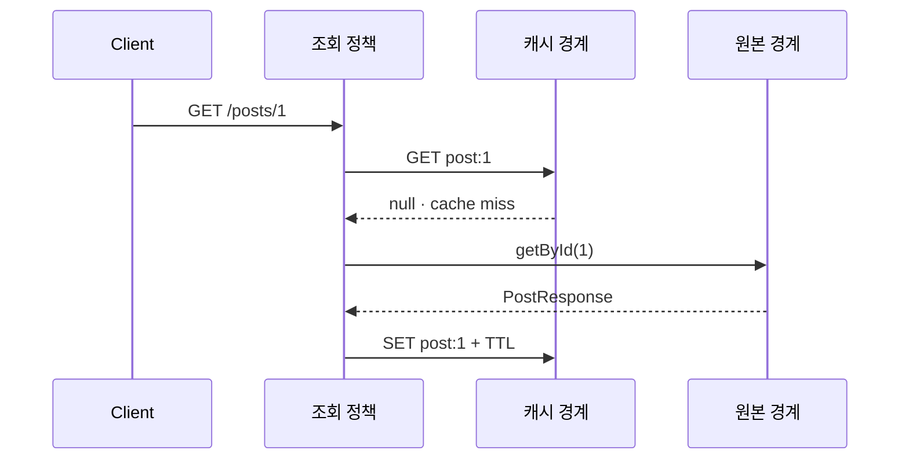

<a id="seq-07"></a>

# Redis Cache 이론 정리

## 1. 같은 데이터를 계속 DB에서 읽어야 할까?

게시글 단건 조회처럼 자주 반복되는 요청은 매번 DB를 읽으면 비용이 쌓입니다.
DB는 원본 데이터를 보관하지만, 모든 조회를 항상 직접 처리할 필요는 없습니다.

이번 시퀀스는 조회 결과를 Redis에 잠시 보관합니다. 핵심은 속도 수치가 아니라 어떤 조건에서 원본을 읽고 언제 파생 복사본을 버리는지 설명하는 것입니다.

가이드 브랜치의 기본 `PostController`와 `PostService`에는 아직 cache-aside 경계가 없습니다. 실습 시작 브랜치에는 `PostQueryService`의 hit/miss/fill이 TODO로 남아 있고, 쓰기 성공 뒤 `evict` 경계는 이미 연결되어 있습니다. 아래 조회 코드는 TODO를 완성했을 때 도달할 목표 흐름이지, 시작 상태에서 이미 실행되는 코드가 아닙니다.

## 2. DB 원본과 Redis 복사본은 수명이 다릅니다

MySQL row는 수정과 삭제의 기준이 되는 원본입니다.
Redis의 `post:{id}` entry는 `PostResponse`를 직렬화한 파생 복사본이며 TTL 또는 명시적인 evict로 사라집니다.

Redis가 정상 응답으로 `null`을 돌려주는 cache miss와 Redis 연결 오류는 다른 사건입니다.
현재 실습은 miss 뒤 DB를 읽는 흐름을 다루며 Redis 장애 fallback까지 보장하지 않습니다.

## 3. 조건이 바뀌면 다음 경로가 바뀝니다

1. `post:1`이 없으면 `PostQueryService`가 `PostCacheService`를 통해 miss를 받습니다.
2. miss 뒤에는 `PostService`와 MySQL에서 원본을 읽고, 응답이 다시 조회 정책으로 돌아옵니다.
3. 조회 정책은 `PostCacheService`에 저장을 맡기고 Redis는 `post:1`과 TTL을 보관합니다.
4. entry가 있고 TTL이 남으면 같은 어댑터 왕복에서 hit가 되고 MySQL은 건너뜁니다.
5. TTL이 지나면 entry는 값이 없는 상태가 되며, 다음 조회가 원본을 읽어 다시 채웁니다. Redis가 MySQL을 자동 조회하지는 않습니다.
6. 수정이나 삭제가 성공하면 기존 entry를 지웁니다. 원본 쓰기가 실패하면 evict까지 진행하지 않습니다.



| 단계 | 들어온 것 | 한 일 | 나간 것 또는 상태 |
|---|---|---|---|
| 1 | 게시글 조회 요청 | 조회 정책으로 id 전달 | `post:1` 확인 시작 |
| 2 | `post:1` key | 캐시 어댑터가 Redis 조회 | entry 또는 `null` |
| 3 | 정상적인 `null` | miss로 판정 | 원본 조회 경로 개방 |
| 4 | `getById(1)` | PostService와 MySQL에서 원본 조회 | `PostEntity` |
| 5 | 원본 row | `PostResponse`로 변환 | 조회 결과 반환 |
| 6 | `PostResponse` | Redis에 JSON과 TTL 저장 | `post:1`이 WARM 상태 |

```text
EMPTY 또는 EXPIRED
-> cache miss
-> MySQL source read
-> Redis fill + TTL
-> WARM
-> cache hit
```

쓰기 성공은 별도 분기를 만듭니다.

```text
DB write success -> DEL post:1 -> 다음 GET에서 miss와 refill
```

## 4. 실제 판단 코드를 읽습니다

조회 정책은 캐시 어댑터가 반환한 값이 있을 때만 즉시 끝납니다.

```kotlin
val cached = postCacheService.get(id)
if (cached != null) {
    return cached
}
```

이 분기 전에는 cache 상태를 모르는 상태이고, 분기 뒤에는 hit면 `PostResponse` 반환으로 끝나며 miss면 원본 조회가 열립니다.

쓰기 흐름에서는 `PostService.update`가 managed entity를 변경하고 `PostResponse`를 만든 뒤 transaction interceptor가 flush·commit을 끝냅니다. Controller는 이 commit이 성공해 Service 호출이 정상 반환된 뒤에만 파생 복사본을 제거합니다.

```kotlin
val response = postService.update(id, request, principal.name)
postCacheService.evict(id)
return response
```

호출 전에는 이전 `post:1` entry가 남아 있을 수 있습니다. entity 변경이나 응답 객체 생성만으로 성공 경계를 앞당기지 않으며, transaction commit과 Controller 정상 복귀 뒤 `evict`가 실행돼야 다음 조회가 최신 원본으로 다시 채웁니다.

## 5. 실행 결과를 증거별로 구분합니다

```bash
docker compose up -d
./gradlew test
```

단위 테스트의 cache get, set, evict 호출은 조회 정책과 호출 순서를 확인합니다.
실제 Redis의 key, JSON 값, 남은 TTL, `DEL` 결과는 실행 중인 Redis에서 별도로 확인해야 합니다.
Mock 호출만으로 live Redis 저장이나 만료가 성공했다고 판단하지 않습니다.

## 6. 다음 질문

TTL은 오래된 entry의 최대 수명을 제한하지만 수정 직후 최신성을 보장하지 않습니다.
invalidation을 빠뜨리면 stale data가 남고, Redis 장애 시에는 miss와 다른 fallback 정책이 필요합니다.

다음 시퀀스에서는 요청마다 연결을 끝내는 HTTP를 넘어, 연결 상태와 topic subscription이 메시지 수신자를 어떻게 결정하는지 확인합니다.

[Visual Lab에서 입력 조건을 보고 경로 예측하기](./visual-lab/sequences/07/)
