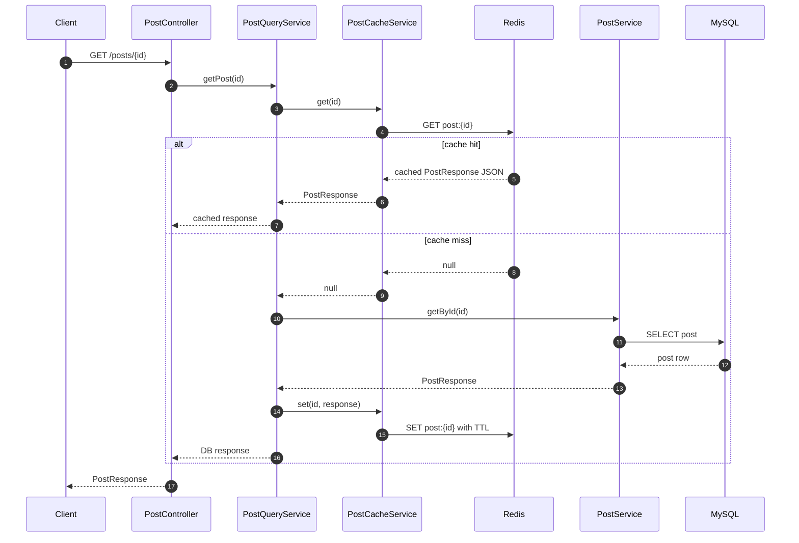
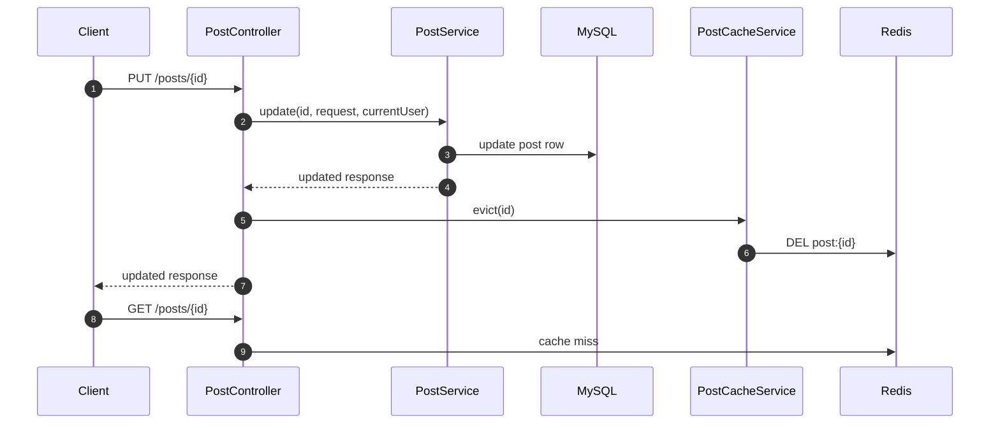
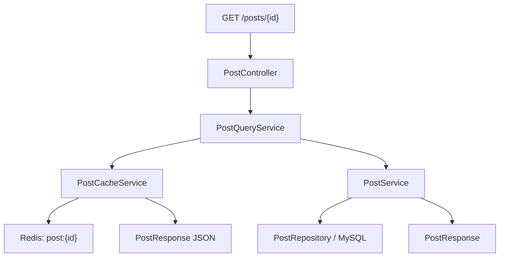

# 이론 정리

> 이번 시퀀스는 게시글 단건 조회 앞에 Redis cache-aside 흐름을 붙이는 단계입니다.
> 이 브랜치에서는 `PostQueryService`와 `PostCacheService`가 hit, miss, JSON 저장, TTL을 어떻게 나누는지 기준으로 구현을 비교합니다.

## 1. Problem - 왜 캐시가 필요한가

게시글 단건 조회가 매번 DB로만 가면 같은 데이터를 반복해서 읽는 비용이 커집니다. 캐시는 이런 반복 조회 부담을 줄이는 보조 저장소입니다.

하지만 캐시를 붙이는 순간 새로운 판단이 필요합니다.

- 캐시에 값이 있을 때 DB를 건너뛰어도 되는가
- 캐시에 값이 없을 때 어떤 기준으로 DB를 조회하는가
- DB 응답을 Redis에 어떤 key와 형식으로 저장하는가
- TTL이 만료되기 전 DB 값이 바뀌면 어떤 위험이 생기는가
- 수정/삭제 직후 오래된 캐시를 어떻게 다룰 것인가

정답 구현은 단건 조회의 cache-aside 흐름과 TTL 저장, 수정/삭제 성공 후 evict까지 코드로 보여줍니다.

## 2. Analyze - 정답 구현에서 선택한 기준

| 기준 | 정답 구현의 선택 | 이유 |
|---|---|---|
| 조회 진입점 | `PostController.getById(...)`가 `PostQueryService.getPost(id)` 호출 | 단건 조회에 캐시 흐름을 집중합니다. |
| hit/miss 조합 | `PostQueryService`가 캐시 확인 후 DB fallback | 조회 흐름을 한곳에서 읽을 수 있습니다. |
| Redis 접근 | `PostCacheService`가 `StringRedisTemplate` 사용 | key-value 문자열 캐시에 집중합니다. |
| 저장 형식 | `PostResponse`를 JSON 문자열로 저장 | API 응답 DTO를 캐시 값으로 재사용합니다. |
| TTL | `cache.post-ttl-seconds` 설정 사용 | 캐시가 영구 저장소처럼 남지 않게 합니다. |

이 기준은 책임 분리와 학습 범위를 함께 고려한 선택입니다. `PostQueryService`는 흐름을 조합하고, `PostCacheService`는 Redis 세부 처리를 맡습니다.

## 3. API / 실행 시퀀스 다이어그램

### 3.1 게시글 단건 조회 cache-aside 흐름

정답 구현은 hit일 때 `PostService`로 가지 않고 바로 반환합니다. miss일 때만 DB 조회로 넘어가고, 조회 결과를 같은 key 규칙으로 Redis에 저장합니다.

### 3.2 쓰기 성공 후 evict 흐름

정답 구현은 DB 수정이나 삭제가 성공한 뒤 `post:{id}`를 제거합니다. TTL은 자동 만료를 담당하고, evict는 쓰기 직후 오래된 값이 응답되는 구간을 줄입니다.

## 4. 계층 / DTO / 메시지 흐름

### 4.1 조회 계층 흐름

| 계층 | 정답 구현에서 확인할 책임 | 주요 파일 |
|---|---|---|
| Controller | 단건 조회 요청을 캐시 조회용 service로 보냅니다. | `PostController.kt` |
| Query Service | cache hit/miss와 DB fallback을 조합합니다. | `PostQueryService.kt` |
| Cache Service | Redis key, JSON 변환, TTL 저장을 담당합니다. | `PostCacheService.kt` |
| Domain Service | DB 기준 게시글 조회를 담당합니다. | `PostService.kt` |
| Config | `StringRedisTemplate` Bean을 등록합니다. | `RedisConfig.kt` |

### 4.2 DTO와 메시지 흐름

| 단계 | 데이터 형태 | 정답 구현에서 확인할 점 |
|---|---|---|
| HTTP 요청 | `id` path variable | 어떤 게시글을 조회할지 정합니다. |
| Redis key | `post:{id}` | 저장과 조회가 같은 key 규칙을 사용합니다. |
| Redis value | `PostResponse` JSON 문자열 | `ObjectMapper`로 DTO와 문자열을 변환합니다. |
| DB 조회 결과 | `PostResponse` | miss일 때 `PostService.getById(id)`가 반환합니다. |
| API 응답 | `PostResponse` | hit이든 miss이든 Controller는 같은 응답 타입을 돌려줍니다. |

## 5. Action - 정답 구현에서 비교할 코드 흐름

### 5.1 Redis 설정과 문자열 캐시

`RedisConfig.kt`는 `StringRedisTemplate`을 Bean으로 등록합니다. 정답 구현은 복잡한 Redis 자료구조가 아니라 문자열 key-value 흐름에 집중합니다.

비교 포인트:

- `spring.data.redis.host`, `spring.data.redis.port`가 설정으로 분리되어 있나요?
- `StringRedisTemplate`이 cache service에서만 직접 사용되나요?
- Redis 세부 설정이 Controller나 PostService로 새어 나가지 않나요?

### 5.2 캐시 조회/저장 책임

`PostCacheService.kt`는 `get`, `set`, `key`, `ttl` 책임을 모읍니다. `get`은 값이 없으면 miss로 이어지도록 `null`을 반환하고, 값이 있으면 JSON 문자열을 `PostResponse`로 되돌립니다.

비교 포인트:

- key 규칙이 `post:{id}`로 일관되나요?
- JSON 직렬화/역직렬화가 cache service 안에 모여 있나요?
- `set(...)`에서 TTL이 함께 적용되나요?

### 5.3 cache-aside 조합

`PostQueryService.kt`는 cache-aside 패턴의 읽는 흐름을 가장 잘 보여주는 위치입니다.

비교 포인트:

- hit이면 `PostService.getById(id)`를 호출하지 않고 반환하나요?
- miss이면 DB 조회 후 Redis에 저장하나요?
- hit/miss 로그가 흐름 확인에 도움이 되나요?

## 6. Result - 확인할 결과와 남은 한계

정답 구현 기준으로 아래를 확인합니다.

- `GET /posts/{id}`가 `PostQueryService`를 통과합니다.
- 캐시 hit이면 Redis 값으로 바로 응답합니다.
- 캐시 miss이면 DB 조회 후 Redis에 저장합니다.
- Redis 저장값은 `PostResponse` JSON 문자열입니다.
- TTL은 `cache.post-ttl-seconds` 설정값으로 적용됩니다.

남는 한계도 함께 봅니다.

- 현재 구현은 수정/삭제가 성공한 뒤 해당 게시글 key를 evict합니다.
- TTL은 자동 만료 장치이고 즉시 최신성 보장 장치가 아닙니다.
- Redis 장애 시 fallback 정책은 이번 시퀀스의 중심 범위가 아닙니다.

## 7. 실무 포인트

- 캐시 도입 전에는 어떤 조회가 반복되는지 먼저 봅니다.
- 캐시 key 규칙이 흔들리면 hit율이 떨어지고 디버깅이 어려워집니다.
- API 응답 DTO를 그대로 캐시할 때는 DTO 변경이 캐시 값 호환성에 영향을 줄 수 있습니다.
- TTL은 오래된 값이 영원히 남는 문제를 줄이지만, 수정 직후 최신성을 보장하지 않습니다.
- 쓰기 흐름이 있는 데이터는 evict, write-through, 짧은 TTL 같은 선택지를 함께 검토해야 합니다.
- cache hit 로그는 학습에는 유용하지만 운영에서는 로그량과 민감정보를 함께 고려해야 합니다.

## 8. 용어 정리

### Cache

- 뜻
  자주 다시 쓰는 데이터를 빠르게 꺼내기 위해 잠깐 보관하는 저장소입니다.
- 왜 중요한가
  반복 조회가 DB로 계속 몰리는 부담을 줄일 수 있습니다.
- 이번 코드에서는 어디에 보이는가
  `PostCacheService.kt`, `PostQueryService.kt`
- 짧은 상황 예시
  같은 게시글을 두 번째 조회할 때 Redis에 저장된 응답을 먼저 확인합니다.

### Redis

- 뜻
  메모리 기반 key-value 저장소입니다.
- 왜 중요한가
  조회 캐시처럼 읽기와 쓰기가 잦은 보조 저장소로 사용하기 좋습니다.
- 이번 코드에서는 어디에 보이는가
  `RedisConfig.kt`, `StringRedisTemplate`, `spring.data.redis.*`
- 짧은 상황 예시
  `post:1` key에 게시글 응답 JSON을 저장합니다.

### Cache-aside

- 뜻
  먼저 캐시를 보고, 없으면 DB를 조회한 뒤 다시 캐시에 저장하는 패턴입니다.
- 왜 중요한가
  기존 DB 조회 흐름을 크게 바꾸지 않고 캐시 레이어를 붙일 수 있습니다.
- 이번 코드에서는 어디에 보이는가
  `PostQueryService.getPost(...)`
- 짧은 상황 예시
  첫 조회는 miss로 DB를 보고, 두 번째 조회는 hit로 Redis에서 응답합니다.

### TTL

- 뜻
  캐시 값이 살아 있는 시간입니다.
- 왜 중요한가
  캐시가 영구 저장소처럼 남지 않도록 합니다.
- 이번 코드에서는 어디에 보이는가
  `cache.post-ttl-seconds`, `PostCacheService.ttl()`
- 짧은 상황 예시
  60초 TTL이면 저장된 캐시 값은 60초 뒤 자동 만료될 수 있습니다.

### Stale Data

- 뜻
  기준 저장소의 최신 값과 다르게 캐시에 남아 있는 오래된 데이터입니다.
- 왜 중요한가
  캐시가 빠른 응답을 주더라도 잘못된 정보를 보여줄 수 있습니다.
- 이번 코드에서는 어디에 보이는가
  수정/삭제 후 `post:{id}` 캐시가 남는 상황을 검토할 때 확인합니다.
- 짧은 상황 예시
  게시글 제목을 수정했는데 TTL이 끝나기 전 예전 제목이 캐시에서 반환될 수 있습니다.

## 9. 다음 구현으로 연결되는 지점

`docs/implementation.md`와 `docs/checklist.md`를 볼 때는 Redis API보다 `PostQueryService`의 분기와 `PostCacheService`의 key/JSON/TTL/evict 책임을 먼저 봅니다. 이후 Redis 캐시를 더 안전하게 만들려면 Redis 장애 fallback과 캐시 직렬화 호환성까지 검토할 수 있습니다.

멘토용 설명 포인트

- miss를 실패가 아니라 DB 조회로 이어지는 정상 흐름으로 설명하게 합니다.
- TTL과 evict는 서로 대체 관계가 아니라 해결하는 시점이 다른 장치로 설명합니다.
- answer 비교 시 Redis 세부 기능보다 `PostQueryService` 흐름과 `PostCacheService` 책임 분리를 중심으로 봅니다.
- stale data 질문은 “수정 직후 다시 조회하면 어떤 값이 보일 수 있나요?”로 시작합니다.

